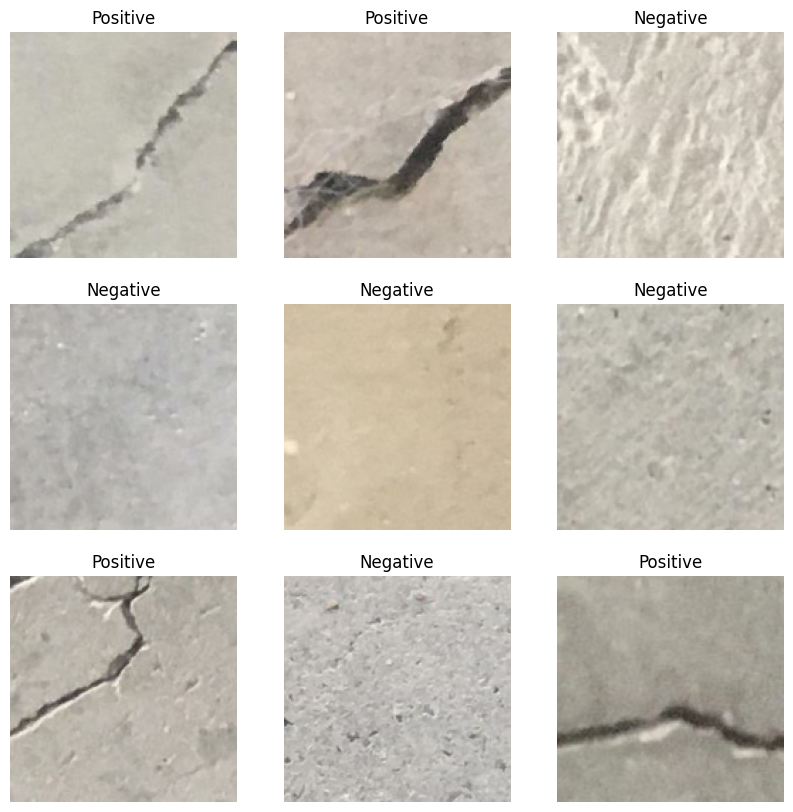
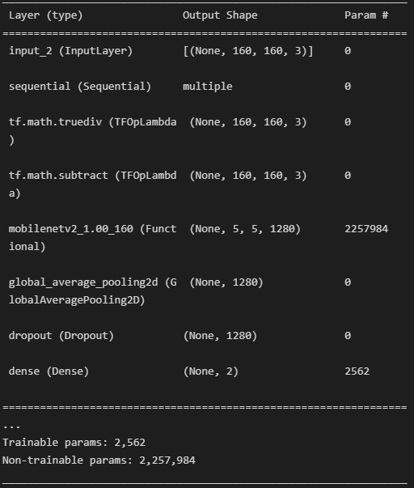
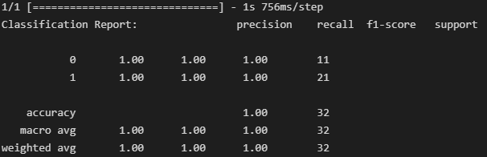
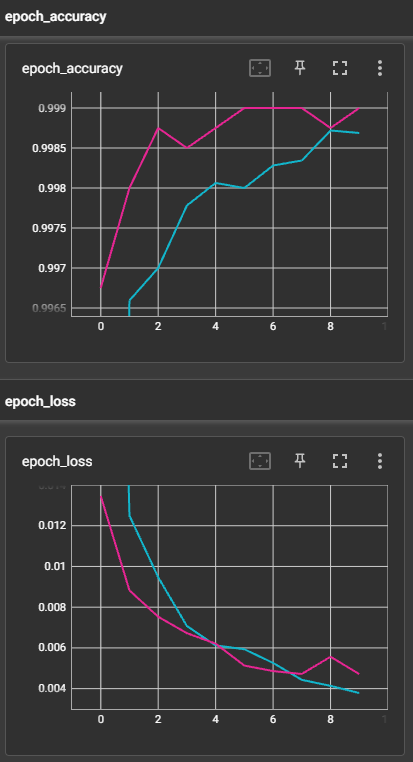

# Concrete_crack_image_classification

There are several types of common concrete cracks namely hairline cracks which
usually develop in concrete foundation as the concrete cures, shrinkage cracks which 
occur while the concrete is curing, settlement cracks which happen when part of 
concrete sinks or when the ground underneath the slab isn’t compacted properly as 
well as structural cracks which form due to incorrect design. 

#### 1. Data Loading
        -Load dataset from directory.

#### 2. Data Preprocessing
        -Converts the training and validation datasets into Prefetch Dataset objects and applies image augmentation using a Sequential model. 
        -Creata a feature extractor using MobileNetV2 and sets it to be non-trainable. 
        
#### 3. Model development
        -Build a model using the feature extractor, global average pooling layer, dense layer and softmax activation. The model takes in an image as input and outputs predictions for each class.

  

#### 4. Model Evaluation
        -Evaluates the model on the validation set and displays the result.
       
#### 5. Model Saving
        -The model saved to a file.
## Results 

The model accuracy is 100%. This cause a suspicion as it is very unlikely for a model to be abel to achieve precision as high as this, so precaution need to be taken when using this code. Further research and investigation is needed if there is any issues to the code that need to be address.

TensorBoard graoh showed minimal overfitting and loss.

## Acknowledgements

 - [The Dataset used is obtained from Çağlar Fırat Özgenel ](https://data.mendeley.com/datasets/5y9wdsg2zt/2)
